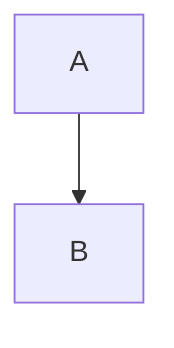
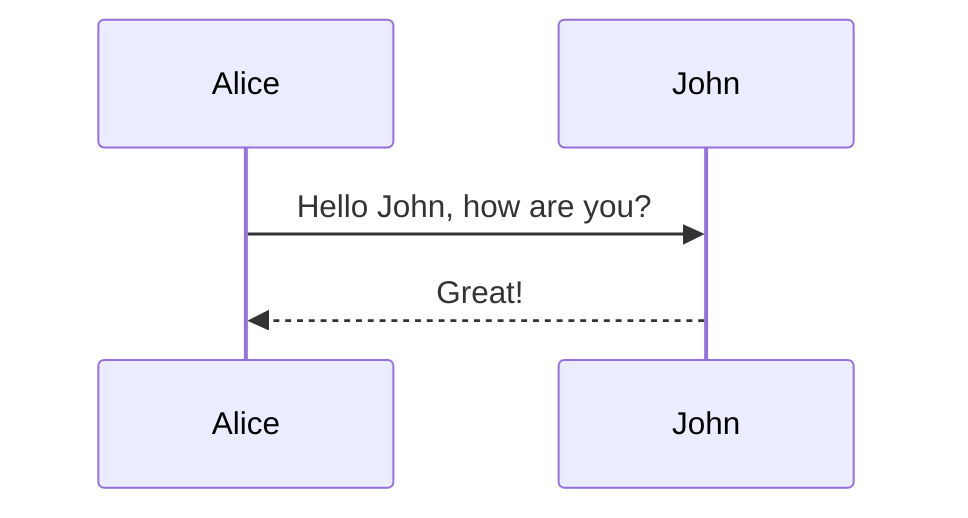
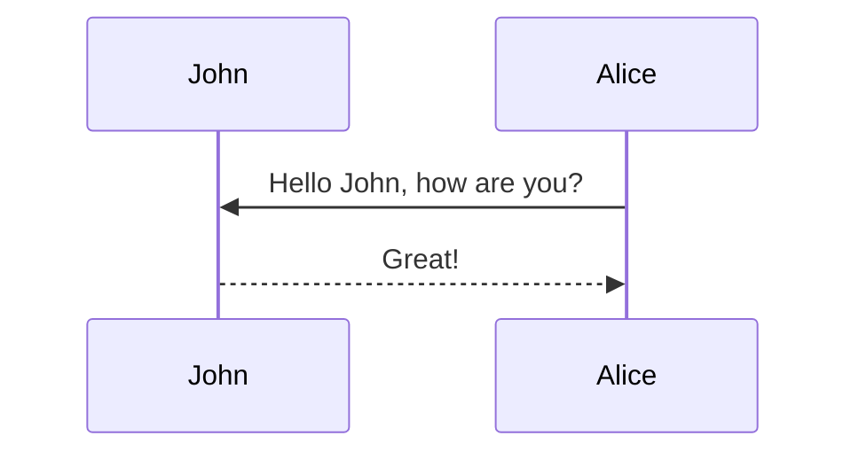
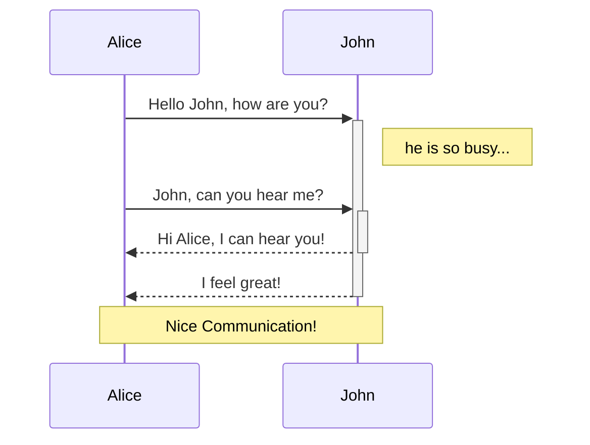

# 利用環境

## 拡張機能 リスト

https://www.bloguchi.info/1282
選択後、control + option + n

1. Paste Image

        ⌘+⇧+⌃+4 スクリーンショットをクリップボードに保存
        ⌘+⌥+v   .mdに貼り付け

Auto-Open Markdown Preview
Markdown All in One

Markdown Preview Mermaid Support

https://qiita.com/ZOOSHIMA/items/693ee8fd93146dd69b0e
|記号|意味|
|:---|:---|
|A -> B|AとBを実線でつなぐ|
|A --> B|AとBを点線でつなぐ|
|A ->> B|AとBを方向つきの実線でつなぐ|
|A -->> B|AとBを方向つきの点線でつなぐ|
|A -x B|AとBを×付きの実線でつなぐ（非同期）|
|A --x B|AとBを×付きの点線でつなぐ（非同期）|

Markdown Preview Enhanced
Markdown PDF
markdownlint

